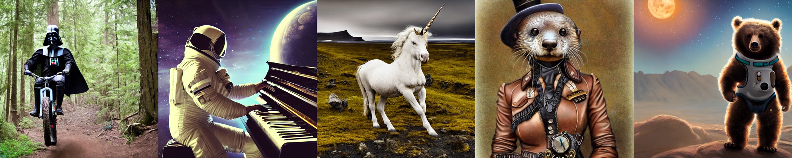
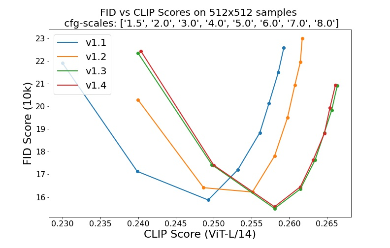

# 稳定扩散
*稳定扩散得益于与 [Stability AI](https://stability.ai/) 和 [Runway](https://runwayml.com/) 的合作，并基于我们之前的工作：*

[**使用潜在扩散模型进行高分辨率图像合成**](https://ommer-lab.com/research/latent-diffusion-models/)<br/>
[Robin Rombach](https://github.com/rromb)\*,
[Andreas Blattmann](https://github.com/ablattmann)\*,
[Dominik Lorenz](https://github.com/qp-qp)\,
[Patrick Esser](https://github.com/pesser),
[Björn Ommer](https://hci.iwr.uni-heidelberg.de/Staff/bommer)<br/>
[CVPR '22 Oral](https://openaccess.thecvf.com/content/CVPR2022/html/Rombach_High-Resolution_Image_Synthesis_With_Latent_Diffusion_Models_CVPR_2022_paper.html) |
[GitHub](https://github.com/CompVis/latent-diffusion) | [arXiv](https://arxiv.org/abs/2112.10752) | [项目页面](https://ommer-lab.com/research/latent-diffusion-models/)


[稳定扩散](#stable-diffusion-v1) 是一种潜在的文本到图像扩散模型。
感谢 [Stability AI](https://stability.ai/) 慷慨的计算资源捐助和 [LAION](https://laion.ai/) 的支持，我们得以在 [LAION-5B](https://laion.ai/blog/laion-5b/) 数据库的子集上训练了一个在 512x512 图像上的潜在扩散模型。
类似于谷歌的 [Imagen](https://arxiv.org/abs/2205.11487)，该模型使用冻结的 CLIP ViT-L/14 文本编码器来根据文本提示进行条件化。
凭借其 860M 的 UNet 和 123M 的文本编码器，该模型相对轻量，可在至少具有 10GB VRAM 的 GPU 上运行。
参见下文的 [此部分](#stable-diffusion-v1) 和 [模型卡](https://huggingface.co/CompVis/stable-diffusion)。

## 要求
可以使用以下命令创建并激活一个名为 `ldm` 的合适 [conda](https://conda.io/) 环境：

```
conda env create -f environment.yaml
conda activate ldm
```

您还可以通过运行以下命令更新现有的 [潜在扩散](https://github.com/CompVis/latent-diffusion) 环境：

```
conda install pytorch torchvision -c pytorch
pip install transformers==4.19.2 diffusers invisible-watermark
pip install -e .
```

## 稳定扩散 v1

稳定扩散 v1 指的是模型架构的特定配置，使用下采样因子 8 的自编码器，包含 860M 的 UNet 和 CLIP ViT-L/14 文本编码器，用于扩散模型。该模型在 256x256 图像上进行预训练，然后在 512x512 图像上进行微调。

*注意：稳定扩散 v1 是一个通用的文本到图像扩散模型，因此会反映其训练数据中存在的偏差和（误）观念。有关训练过程和数据的详细信息，以及模型的预期用途，可在相应的 [模型卡](Stable_Diffusion_v1_Model_Card.md) 中找到。*

权重可通过 [Hugging Face 上的 CompVis 组织](https://huggingface.co/CompVis) 获得，遵循 [包含特定使用限制以防止误用和伤害的许可证，但总体上保持宽松](LICENSE)。虽然许可证条款允许商业使用，**我们不建议在没有额外安全机制和考虑的情况下将提供的权重用于服务或产品**，因为权重存在 [已知的限制和偏差](Stable_Diffusion_v1_Model_Card.md#limitations-and-bias)，并且关于通用文本到图像模型的安全和道德部署研究仍在进行中。**权重是研究产物，应按此对待。**

[CreativeML OpenRAIL M 许可证](LICENSE) 是一种 [Open RAIL M 许可证](https://www.licenses.ai/blog/2022/8/18/naming-convention-of-responsible-ai-licenses)，改编自 [BigScience](https://bigscience.huggingface.co/) 和 [RAIL 倡议](https://www.licenses.ai/) 在负责任 AI 许可领域的联合工作。另见基于我们许可证的 [关于 BLOOM Open RAIL 许可证的文章](https://bigscience.huggingface.co/blog/the-bigscience-rail-license)。

### 权重

我们目前提供以下检查点：

- `sd-v1-1.ckpt`：在 [laion2B-en](https://huggingface.co/datasets/laion/laion2B-en) 上以 `256x256` 分辨率进行 237k 步训练。
  在 [laion-high-resolution](https://huggingface.co/datasets/laion/laion-high-resolution)（来自 LAION-5B 的 170M 样本，分辨率 `>= 1024x1024`）上以 `512x512` 分辨率进行 194k 步训练。
- `sd-v1-2.ckpt`：从 `sd-v1-1.ckpt` 继续训练。
  在 [laion-aesthetics v2 5+](https://laion.ai/blog/laion-aesthetics/)（laion2B-en 的子集，估计美学评分 `> 5.0`，并额外过滤为原始尺寸 `>= 512x512` 的图像，且估计水印概率 `< 0.5`。水印估计来自 [LAION-5B](https://laion.ai/blog/laion-5b/) 元数据，美学评分使用 [LAION-Aesthetics Predictor V2](https://github.com/christophschuhmann/improved-aesthetic-predictor) 估计）上以 `512x512` 分辨率进行 515k 步训练。
- `sd-v1-3.ckpt`：从 `sd-v1-2.ckpt` 继续训练。在 "laion-aesthetics v2 5+" 上以 `512x512` 分辨率进行 195k 步训练，并以 10% 的文本条件丢弃来改进 [无分类器引导采样](https://arxiv.org/abs/2207.12598)。
- `sd-v1-4.ckpt`：从 `sd-v1-2.ckpt` 继续训练。在 "laion-aesthetics v2 5+" 上以 `512x512` 分辨率进行 225k 步训练，并以 10% 的文本条件丢弃来改进 [无分类器引导采样](https://arxiv.org/abs/2207.12598)。

使用不同无分类器引导尺度（1.5、2.0、3.0、4.0、5.0、6.0、7.0、8.0）和 50 个 PLMS 采样步骤的评估显示了检查点的相对改进：


### 使用稳定扩散进行文本到图像生成


稳定扩散是一个基于 CLIP ViT-L/14 文本编码器的（非池化）文本嵌入进行条件化的潜在扩散模型。
我们提供了 [参考采样脚本](#reference-sampling-script)，但也存在 [diffusers 集成](#diffusers-integration)，我们期待看到更活跃的社区开发。

#### 参考采样脚本

我们提供了一个参考采样脚本，其中包括：

- 一个 [安全检查模块](https://github.com/CompVis/stable-diffusion/pull/36)，以降低显式输出的概率，
- 对输出的 [不可见水印](https://github.com/ShieldMnt/invisible-watermark)，以帮助观众 [识别图像为机器生成](scripts/tests/test_watermark.py)。

在 [获得 `stable-diffusion-v1-*-original` 权重](#weights) 后，链接它们
```
mkdir -p models/ldm/stable-diffusion-v1/
ln -s <path/to/model.ckpt> models/ldm/stable-diffusion-v1/model.ckpt 
```
并使用以下命令进行采样
```
python scripts/txt2img.py --prompt "一张宇航员骑马的照片" --plms 
```

默认情况下，这使用 `--scale 7.5` 的引导尺度，[Katherine Crowson 的实现](https://github.com/CompVis/latent-diffusion/pull/51) 的 [PLMS](https://arxiv.org/abs/2202.09778) 采样器，并以 50 步渲染 512x512 图像（训练时使用的分辨率）。所有支持的参数如下所示（输入 `python scripts/txt2img.py --help`）。

```commandline
用法: txt2img.py [-h] [--prompt [PROMPT]] [--outdir [OUTDIR]] [--skip_grid] [--skip_save] [--ddim_steps DDIM_STEPS] [--plms] [--laion400m] [--fixed_code] [--ddim_eta DDIM_ETA]
                  [--n_iter N_ITER] [--H H] [--W W] [--C C] [--f F] [--n_samples N_SAMPLES] [--n_rows N_ROWS] [--scale SCALE] [--from-file FROM_FILE] [--config CONFIG] [--ckpt CKPT]
                  [--seed SEED] [--precision {full,autocast}]

可选参数:
  -h, --help            显示此帮助信息并退出
  --prompt [PROMPT]     要渲染的提示
  --outdir [OUTDIR]     写入结果的目录
  --skip_grid           不保存网格，仅保存单个样本。在评估大量样本时有用
  --skip_save           不保存单个样本。用于速度测量。
  --ddim_steps DDIM_STEPS
                        DDIM 采样步骤数
  --plms                使用 PLMS 采样
  --laion400m           使用 LAION400M 模型
  --fixed_code          如果启用，跨样本使用相同的起始代码
  --ddim_eta DDIM_ETA   DDIM eta（eta=0.0 对应确定性采样）
  --n_iter N_ITER       采样频率
  --H H                 图像高度，像素空间
  --W W                 图像宽度，像素空间
  --C C                 潜在通道
  --f F                 下采样因子
  --n_samples N_SAMPLES
                        为每个给定提示生成多少样本。即批次大小
  --n_rows N_ROWS       网格中的行数（默认：n_samples）
  --scale SCALE         无条件引导尺度：eps = eps(x, empty) + scale * (eps(x, cond) - eps(x, empty))
  --from-file FROM_FILE
                        如果指定，从此文件中加载提示
  --config CONFIG       构建模型的配置文件路径
  --ckpt CKPT           模型检查点路径
  --seed SEED           种子（用于可重现采样）
  --precision {full,autocast}
                        以此精度进行评估
```
注意：所有 v1 版本的推理配置设计用于仅使用 EMA 检查点。
因此，配置中设置了 `use_ema=False`，否则代码将尝试从非 EMA 切换到 EMA 权重。如果您想检查 EMA 与非 EMA 的效果，我们提供了包含两种权重类型的“完整”检查点。对于这些，`use_ema=False` 将加载并使用非 EMA 权重。

#### Diffusers 集成

一个简单的方式是使用 [diffusers 库](https://github.com/huggingface/diffusers/tree/main#new--stable-diffusion-is-now-fully-compatible-with-diffusers) 下载和采样稳定扩散：
```py
# 确保使用 `huggingface-cli login` 登录
from torch import autocast
from diffusers import StableDiffusionPipeline

pipe = StableDiffusionPipeline.from_pretrained(
    "CompVis/stable-diffusion-v1-4", 
    use_auth_token=True
).to("cuda")

prompt = "一张宇航员在火星上骑马的照片"
with autocast("cuda"):
    image = pipe(prompt)["sample"][0]  
    
image.save("astronaut_rides_horse.png")
```

### 使用稳定扩散进行图像修改

通过使用 [SDEdit](https://arxiv.org/abs/2108.01073) 首次提出的扩散去噪机制，该模型可用于不同的任务，如文本引导的图像到图像转换和上采样。类似于 txt2img 采样脚本，我们提供了一个脚本以使用稳定扩散进行图像修改。

以下描述了一个示例，其中在 [Pinta](https://www.pinta-project.com/) 中制作的粗略草图被转换为详细的艺术作品。
```
python scripts/img2img.py --prompt "奇幻景观，在 artstation 上流行" --init-img <path-to-img.jpg> --strength 0.8
```
在这里，strength 是一个介于 0.0 和 1.0 之间的值，控制添加到输入图像的噪声量。接近 1.0 的值允许大量变化，但也会生成与输入图像语义不一致的图像。参见以下示例。

**输入**


**输出**


此过程，例如，也可用于对基础模型的样本进行上采样。

## 评论

- 我们的扩散模型代码库在很大程度上基于 [OpenAI 的 ADM 代码库](https://github.com/openai/guided-diffusion)
和 [https://github.com/lucidrains/denoising-diffusion-pytorch](https://github.com/lucidrains/denoising-diffusion-pytorch)。感谢开源！

- 转换器编码器的实现来自 [x-transformers](https://github.com/lucidrains/x-transformers) by [lucidrains](https://github.com/lucidrains?tab=repositories)。

## BibTeX

```
@misc{rombach2021highresolution,
      title={使用潜在扩散模型进行高分辨率图像合成}, 
      author={Robin Rombach and Andreas Blattmann and Dominik Lorenz and Patrick Esser and Björn Ommer},
      year={2021},
      eprint={2112.10752},
      archivePrefix={arXiv},
      primaryClass={cs.CV}
}
```